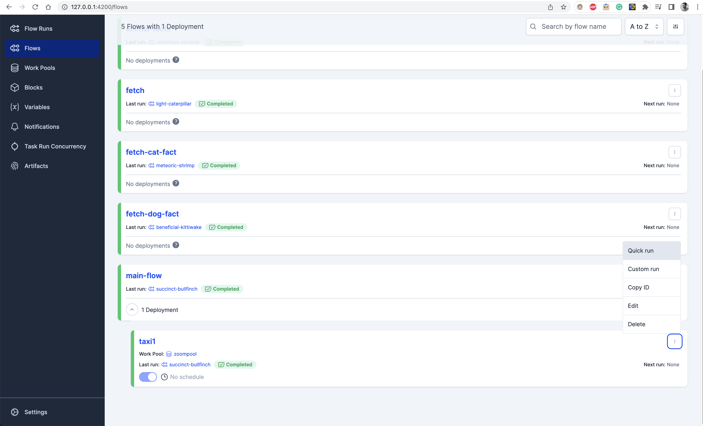

# Steps

1. On one terminal:

    ```shell
    prefect server start
    ```

2. On another terminal, go to the root directory of the repository.

3. On that terminal run:

    ```shell
    prefect project init
    prefect deploy 03-workflow-orchestration/3.4/orchestrate.py:main_flow -n taxi1 -p zoompool
    prefect worker start -p zoompool
    ```

4. On the Prefect UI, click on `Flows` and then on `Quick run` on the flow:

    
