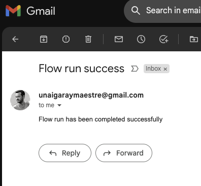

## Q1. Human-readable name

You’d like to give the first task, read_data a nicely formatted name. How can you specify a task name?

Answer in [task-arguments](https://docs.prefect.io/2.10.13/concepts/tasks/?h=task#task-arguments)

* --> **@task(retries=3, retry_delay_seconds=2, name="Read taxi data")** <--

* @task(retries=3, retry_delay_seconds=2, task_name="Read taxi data")

* @task(retries=3, retry_delay_seconds=2, task-name="Read taxi data")

* @task(retries=3, retry_delay_seconds=2, task_name_function=lambda x: f"Read taxi data")

## Q2. Cron

Cron is a common scheduling specification for workflows.

Using the flow in `orchestrate.py`, create a deployment. Schedule your deployment to run on the third day of every month at 9am UTC. What’s the cron schedule for that?

* --> **`0 9 3 * *`** <--

* `0 0 9 3 *`

* `9 * 3 0 *`

* `* * 9 3 0`

## Q3. RMSE

Download the January 2023 Green Taxi data and use it for your training data. Download the February 2023 Green Taxi data and use it for your validation data.

Make sure you upload the data to GitHub so it is available for your deployment.

Create a custom flow run of your deployment from the UI. Choose Custom Run for the flow and enter the file path as a string on the JSON tab under Parameters.

Make sure you have a worker running and polling the correct work pool.

View the results in the UI.

What’s the final RMSE to five decimal places?

* 6.67433

* --> **5.19931** <--

* 8.89443

* 9.12250

## Q4. RMSE (Markdown Artifact)

Download the February 2023 Green Taxi data and use it for your training data.

Download the March 2023 Green Taxi data and use it for your validation data.

Create a Prefect Markdown artifact that displays the RMSE for the validation data. Create a deployment and run it.

What’s the RMSE in the artifact to two decimal places ?

* 9.71

* 12.02

* 15.33

* --> **5.37** <--

## Q5. Emails

It’s often helpful to be notified when something with your dataflow doesn’t work as planned. Create an email notification for to use with your own Prefect server instance. In your virtual environment, install the prefect-email integration with

`pip install prefect-email`

Make sure you are connected to a running Prefect server instance through your Prefect profile. See the docs if needed: <https://docs.prefect.io/latest/concepts/settings/#configuration-profiles>

Register the new block with your server with

`prefect block register -m prefect_email`

Remember that a block is a Prefect class with a nice UI form interface. Block objects live on the server and can be created and accessed in your Python code.

See the docs for how to authenticate by saving your email credentials to a block and note that you will need an App Password to send emails with Gmail and other services. Follow the instructions in the docs.

Create and save an EmailServerCredentials notification block. Use the credentials block to send an email.

Test the notification functionality by running a deployment.

1. `pip install prefect-email`

2. `prefect block register -m prefect_email`

3. `prefect server start`

4. `python3 03-workflow-orchestration/homework/register_email_block.py`

5. `prefect deploy 03-workflow-orchestration/homework/orchestrate_q5.py:homework_flow_q5 -n homework_email -p zoompool`

6. `prefect worker start -p zoompool`

7. Start flow run from UI.

8. Receive email:

    

What is the name of the pre-built prefect-email task function?

* send_email_message

* --> **email_send_message** <--

* send_email

* send_message

## Q6. Prefect Cloud

The hosted Prefect Cloud lets you avoid running your own Prefect server and has automations that allow you to get notifications when certain events occur or don’t occur.

Create a free forever Prefect Cloud account at app.prefect.cloud and connect your workspace to it following the steps in the UI when you sign up.

Set up an Automation from the UI that will send yourself an email when a flow run completes. Run one of your existing deployments and check your email to see the notification.

Make sure your active profile is pointing toward Prefect Cloud and make sure you have a worker active.

What is the name of the second step in the Automation creation process?

* Details

* Trigger

* --> **Actions** <--

* The end

To run it through Cloud Run follow these instructions: [Serverless Prefect Flows with Google Cloud Run Jobs](https://medium.com/the-prefect-blog/serverless-prefect-flows-with-google-cloud-run-jobs-23edbf371175)
