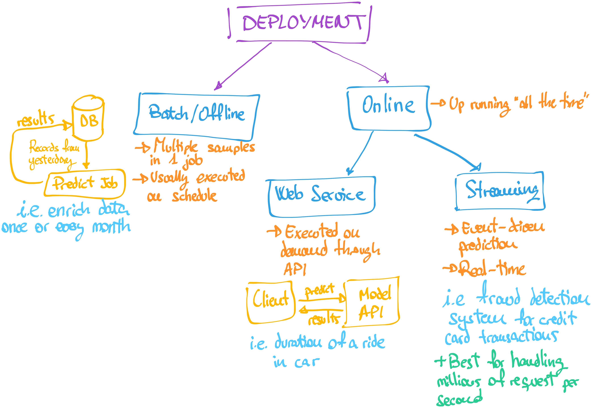

# 4 - Deployment

This 4th chapter in the MLOps zoomcamp discusses two modes of model deployment - batch (offline) prediction and online (real-time) prediction.

Here is the diagram that illustrates the two modes:

## Batch/Online Predictions

Batch predictions are performed on a collection of observations at once. This mode of prediction is typically used when predictions are not required in real time, but can be computed periodically and stored for later use.

For example, a model might predict next week's sales based on the past month's data. These predictions could be computed once a day and stored in a database.

Batch predictions are typically performed using a batch processing framework, which can handle large amounts of data and perform computations in a distributed manner to speed up processing.

## Online/Real-Time Predictions

Online predictions are performed in real time, as observations arrive. This mode of prediction is used when it's important to make predictions and take action immediately.

For example, a model might predict whether a credit card transaction is fraudulent. These predictions must be made immediately so that a fraudulent transaction can be blocked.

Online predictions are typically performed using a model server, which loads the model into memory and exposes an API for making predictions. The model server might be part of a larger microservices architecture, or it might be a standalone application.

### Real-Time Streaming Predictions

Real-time streaming predictions is a special case of online predictions where data comes in streams. In these scenarios, the prediction system needs to process and make predictions in real-time as each data point arrives in the stream. This is often used in use cases where data is continuously generated and needs immediate processing like in IoT (Internet of Things) systems, real-time recommendation systems, or real-time anomaly detection systems.

## Choosing Between Batch and Online Predictions

Whether to use batch or online predictions depends on your use case. Here are some factors to consider:

Data volume and velocity: If you have a large amount of data or data that arrives quickly, a batch processing framework might be better suited to handle the load. On the other hand, if you need to make predictions as soon as data arrives, an online prediction system or a real-time streaming prediction system might be necessary.

Response time: If you need to make predictions and take action immediately, you'll need an online prediction system. If it's acceptable to wait a while for predictions, a batch prediction system might be sufficient.

Computational resources: Batch processing frameworks can distribute computations across multiple nodes to speed up processing, which can be helpful if you have a large amount of data or a complex model. On the other hand, model servers typically load the model into memory and make predictions on a single node, which can be faster for simple models or small data sets.
