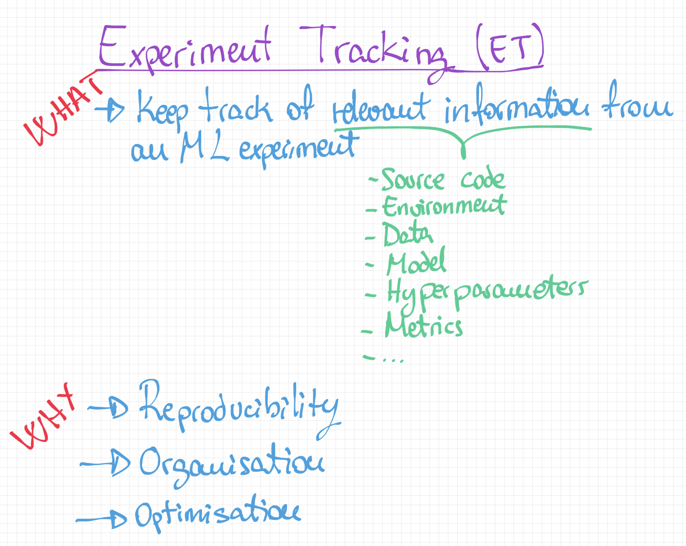
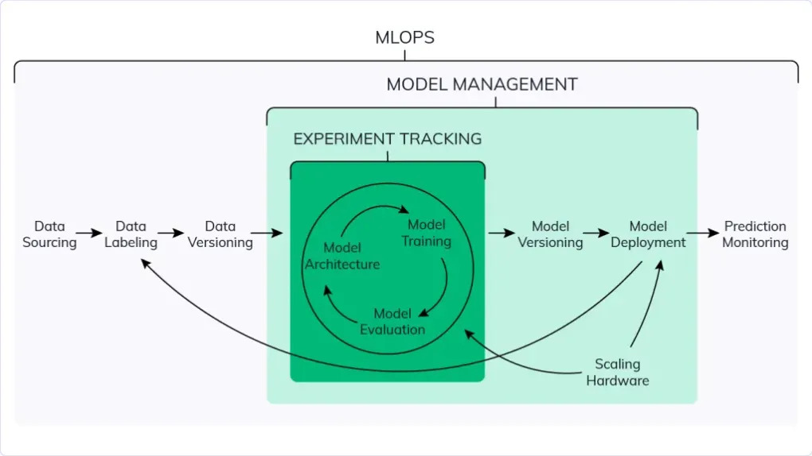
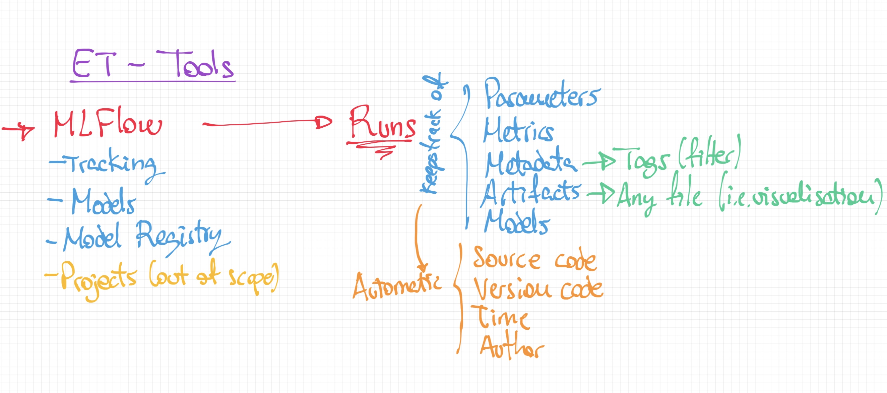

# mlops-zoomcamp-workshop

Notes and work for the MLOps Zoomcamp course

## 1 - Intro

This first introduction mentions what a normal process of going from experimentation to production would look like.

What is discussed in this lesson:

1. Model training for a specific use case in a **Jupyter Notebook**

2. How to go from Jupyter to Production:

    

3. Explanation of the Maturity Model:

    

## 2 - Experiment Tracking

Every model training process goal is to come up with the best performing configuration of training data, metrics, hyperparameters, code, etc.

The road to finding this configuration goes through running a lot of experiments, analyzing their results, and trying new ideas. You can think about experiment tracking as a bridge between this road and the goal.

Machine learning experiment tracking is the process of saving all experiment-related information (metadata) that you care about for every experiment you run.

What is discussed in this lesson:

1. Experiment Tracking (ET) intro:

    

2. ET workflow:

    

3. ET Tools:

    
