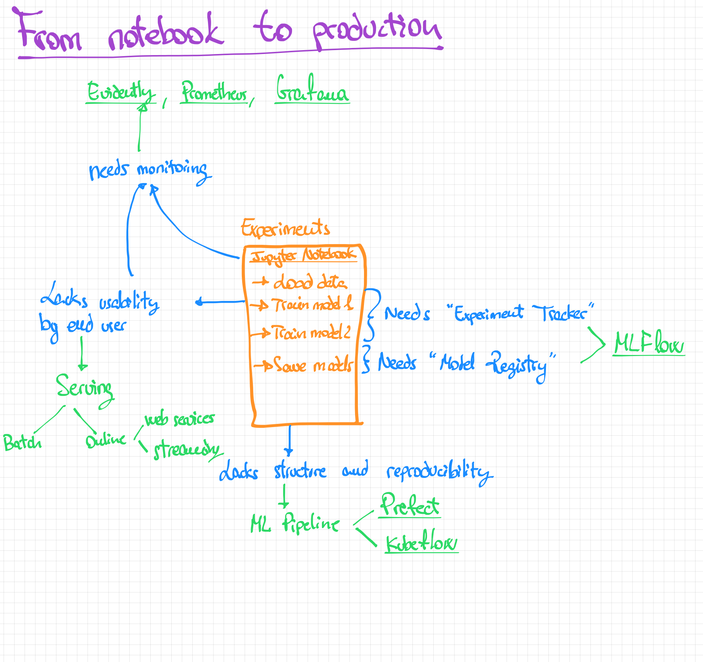
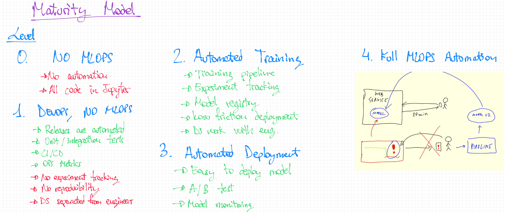

# mlops-zoomcamp-workshop

Notes and work for the MLOps Zoomcamp course

## 1 - Intro

This first introduction mentions what a normal process of going from experimentation to production would look like.

What is discussed in this lesson:

1. Model training for a specific use case in a **Jupyter Notebook**

2. How to go from Jupyter to Production:

    

3. Explanation of the Maturity Model:

    
